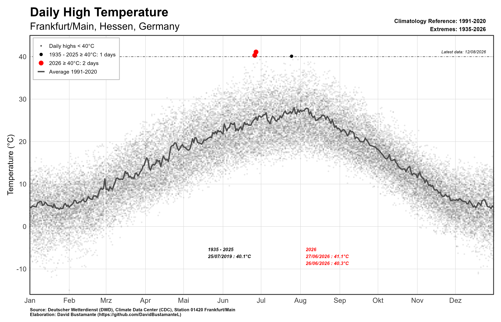

# Frankfurt am Main, Hessen, Germany - Days above 40°C 2016 vs Rest of available Data

## Motivation

The idea for this small project came from a graph I saw circulating on Twitter/X. It showed daily temperatures in Bordeaux, France, and highlighted the surprisingly large number of days reaching temperatures around or above 40°C.

Seeing that graph made me curious about what the same comparison would look like for Frankfurt am Main.

So I downloaded the historical daily temperature data from the **Deutscher Wetterdienst (DWD)** and compared the temperatures observed in 2026 with the historical record.

The result is this visualization.

<p align="center">
  
</p>

What I found was striking: **in the Frankfurt data used here, 2026 has already recorded more days at or above 40°C than all previous years in the available record combined.** And 2026 is not even over yet.

Of course, this does not mean that one weather station or one year can, by itself, demonstrate climate change. A single hot day cannot simply be attributed to global warming, and this visualization is not intended to be an event-attribution study. But the result fits into a much broader and well-documented development: **heatwaves in Europe are becoming more frequent, more intense, and increasingly dangerous.**

A day above 40°C is therefore more than just an interesting statistical observation. Extreme heat affects human health, agriculture, ecosystems, infrastructure, productivity, energy demand, and the general livability of our cities.

The human consequences are already visible. By late July 2026, the **Robert Koch Institute (RKI) estimated around 11,900 heat-related deaths in Germany during 2026**, with most of them associated with the extreme temperatures experienced in late June. During the week of 22–28 June alone, the Federal Statistical Office reported that overall mortality in Germany was **32% above the median of the previous four years**.

These are not just points on a graph.

Climate change is no longer only an abstract problem of the distant future. Its consequences are increasingly measurable in temperatures, health outcomes, infrastructure, agriculture, and ultimately in human lives.

And this makes it a political issue as well.

Politics has to act to prevent the tragedy of global warming from becoming much larger than it already is. This means reducing greenhouse-gas emissions, investing in adaptation, protecting vulnerable populations, improving the resilience of cities and infrastructure, and coordinating climate policy internationally.

There is an important difference between saying that climate change can no longer be prevented entirely and saying that nothing can be done. **Every additional degree of warming matters, and so does every fraction of a degree that can still be avoided.**

The real tragedy of global warming would therefore not only be the warming itself. It would be allowing its consequences to become much worse even though we know that many of them can still be limited.

This small project is my attempt to make a part of that development visible using official weather data from Frankfurt.

---

## What does the script do?

The R script downloads daily climate observations directly from the **DWD Climate Data Center** for the Frankfurt/Main weather station.

It then:

- downloads historical DWD climate files;
- downloads the most recent DWD observations;
- combines both datasets;
- removes overlapping observations;
- gives priority to the recent DWD data where historical and recent files overlap;
- extracts the daily maximum air temperature;
- puts all years on the same January–December axis;
- calculates the climatological daily average for 1991–2020;
- identifies days with temperatures of at least 40°C;
- separates extreme days before 2026 from those observed in 2026;
- prints the exact dates and temperatures of these extreme observations;
- produces a visualization comparing the complete historical temperature record.

---

## Data

The data are provided by the:

**Deutscher Wetterdienst (DWD)**  
**Climate Data Center (CDC)**

The weather station used in this analysis is:

- **Station:** Frankfurt/Main
- **Station ID:** `01420`

The relevant DWD variable is:

`TXK`

which represents the **daily maximum air temperature in °C**.

The script downloads the observations directly from the DWD Open Data servers, so no manually prepared input dataset is required.

---

## Settings

The main parameters can be changed at the beginning of the script:

```r
station_id = "01420"
station_name = "Frankfurt/Main"

end_date = as.Date("2026-08-12")

extreme_threshold = 40

climatology_start = 1991
climatology_end = 2020
```

The current version therefore:

- uses the Frankfurt/Main weather station;
- includes observations up to **12 August 2026**;
- defines an extreme-temperature day as a day with a maximum temperature of **40°C or more**;
- uses **1991–2020** as the climatological reference period.

---

## Required R packages

The script uses the following packages:

```r
library(tidyverse)
library(magrittr)
library(httr)
library(lubridate)
library(glue)
library(janitor)
```

If they are not already installed, they can be installed with:

```r
install.packages(
  c(
    "tidyverse",
    "magrittr",
    "httr",
    "lubridate",
    "glue",
    "janitor"
  )
)
```

---

## DWD data

The script uses the historical and recent daily climate observations provided through the DWD Climate Data Center.

The relevant DWD directories are accessed directly from R, and the script automatically searches for ZIP files belonging to station `01420`.

The function

```r
find_dwd_files()
```

searches the DWD directory for the relevant station files.

The function

```r
read_dwd_zip()
```

then:

1. downloads the ZIP file;
2. extracts its contents;
3. identifies the daily climate data file;
4. reads the data into R;
5. cleans the variable names;
6. converts DWD missing-value codes such as `-999` into `NA`.

---

## Combining historical and recent observations

Historical and recent DWD files can contain overlapping dates.

For that reason, the script gives the recent observations priority:

```r
source_priority = if_else(
  source == "recent",
  1,
  0
)
```

The observations are then sorted by date and source priority before duplicate dates are removed.

This makes sure that, where both datasets contain the same day, the most recent DWD observation is retained.

---

## Daily maximum temperature

The relevant variable is:

```r
txk
```

which is converted into the simpler variable:

```r
tx
```

The script also creates:

```r
date
year
month_day
plot_date
```

These variables are used to prepare the historical observations for comparison and plotting.

---

## Putting all years on the same calendar axis

One important feature of the visualization is that observations from all years are plotted on the same January-to-December axis.

For example, a temperature measured on 15 July 1995 and one measured on 15 July 2026 appear at the same horizontal position.

To achieve this, the script extracts the month and day:

```r
month_day = format(
  date,
  "%m-%d"
)
```

and assigns each observation to a dummy year:

```r
plot_date = as.Date(
  paste0(
    "2024-",
    month_day
  )
)
```

The year 2024 is used because it is a leap year and therefore also allows 29 February to be represented.

The actual year of each temperature observation is not changed in the underlying data. The dummy date is used only for the x-axis of the visualization.

---

## Climatological reference period

The climatological reference period used in the project is:

**1991–2020**

For every calendar day, the script calculates the average daily maximum temperature across this period:

```r
climatology = frankfurt %>%
  filter(
    year >= climatology_start,
    year <= climatology_end
  ) %>%
  group_by(
    plot_date
  ) %>%
  summarise(
    average = mean(
      tx,
      na.rm = TRUE
    ),
    .groups = "drop"
  )
```

This produces the reference line in the final figure.

It provides a simple benchmark for what the typical daily maximum temperature looks like throughout the year.

---

## Extreme temperatures

For this visualization, an extreme-temperature day is defined as:

```r
extreme_threshold = 40
```

The script therefore identifies all observations with:

```r
tx >= 40
```

These observations are separated into two groups.

### Historical extremes

```r
extreme_old = frankfurt %>%
  filter(
    year <= 2025,
    tx >= extreme_threshold
  )
```

### Extreme days in 2026

```r
extreme_2026 = frankfurt %>%
  filter(
    year == 2026,
    tx >= extreme_threshold
  )
```

This makes it possible to visually distinguish the 2026 observations from previous extreme-temperature days.

The threshold can easily be modified if another definition of extreme heat is preferred.

---

## Output

The main output is a `ggplot2` visualization showing:

- all historical daily maximum temperatures below 40°C;
- historical observations at or above 40°C;
- observations at or above 40°C during 2026;
- the 1991–2020 climatological daily average;
- a horizontal 40°C threshold line;
- the exact dates and temperatures of extreme observations;
- the number of historical and 2026 extreme-temperature days.

The final plot is stored as, and displayed with:

```r
p
```

---

## Saving the figure

The figure is saved with:

```r
ggsave(
  filename = 
    "frankfurt_daily_high_temperature.png",
  plot = p,
  width = 14,
  height = 9,
  dpi = 300
)
```

The resulting file is:

```text
frankfurt_daily_high_temperature.png
```

with a resolution of **300 dpi**.

---

## How to run the project

Clone or download the repository and open the R script.

Then run the script from top to bottom.

An internet connection is required because the historical and recent climate observations are downloaded directly from the DWD servers.

No separate input dataset needs to be downloaded beforehand.

---

## Reproducibility

The script downloads the underlying observations directly from the DWD servers every time it is executed.

Because recent DWD observations may subsequently be updated, results can change slightly when the script is rerun at a later date.

For this reason, the analysis explicitly specifies an endpoint:

```r
end_date = as.Date("2026-08-12")
```

Only observations up to this date are used.

This makes it possible to reproduce the version of the visualization created for this project even after newer observations become available.

---

## Why climate policy matters

This repository is primarily about data visualization, not climate modelling or climate policy research.

Nevertheless, the motivation behind it is impossible to separate completely from the broader climate debate.

Global warming is not something that politics can simply observe from the sidelines.

The severity of future warming depends, in part, on decisions made today.

The severity of its consequences also depends on whether governments prepare infrastructure, healthcare systems, cities, agriculture, and vulnerable populations for a hotter climate.

Political inaction therefore has consequences too.

There is still an enormous difference between a future in which warming is limited and societies adapt effectively, and one in which emissions continue for longer and adaptation remains inadequate.

Preventing the tragedy of global warming from becoming much larger requires political action.

That is perhaps the most important motivation behind this project.

The figure itself is only a collection of temperature observations.

But behind every point is a much bigger question:

**How much worse are we willing to let this become before we act accordingly?**

---

## Data source

**Deutscher Wetterdienst (DWD)**  
Climate Data Center (CDC)  
Daily climate observations for Germany

Weather station:

**Frankfurt/Main — Station 01420**

---

## Author

**David Bustamante**

Analysis and visualization in R.
